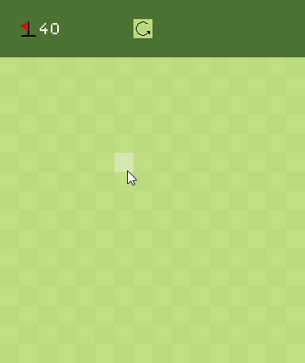
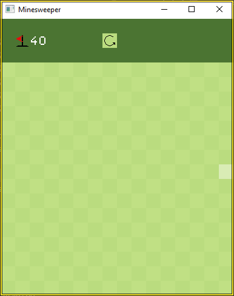
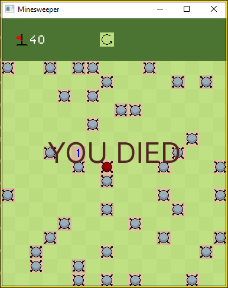
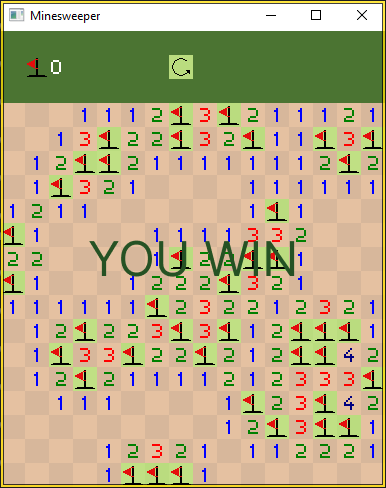

# OpenGL Minesweeper

This is my second OpenGL and C++ project, in this game i implemented spritesheets 
hover effects, left and right mouse button events and most of the minesweeper 
mechanics. Once again, taking in consideration that i am still learning the 
c++ language and OpenGL the code is not 100% well organized and optimized, check 
my latest projects for better code.



## Dependencies

- OpenGL Loader [Glad 4.6 Core](https://glad.dav1d.de/)
- Window Manager [GLFW 3.3.8](https://www.glfw.org/download.html)
- Math [GLM 0.9.9.8](https://github.com/g-truc/glm)
- Compiler Mingw64 gcc 13.2.0

## Install

```
git clone https://github.com/iuryferreiradev/minesweeper.git
```

```
cd minesweeper
build
```

Or double click the build.bat to build the project and run it.

## Screenshots

### Game Screen


### Game Over Screen (Lose)


### Game Over Screen (Win)
